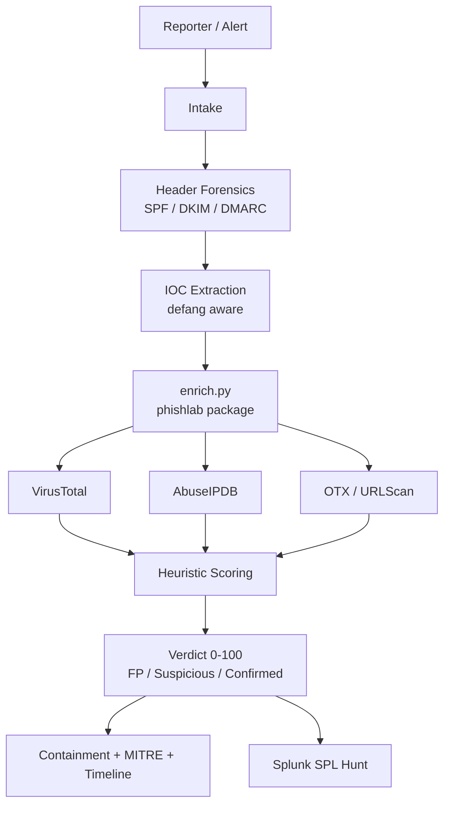

# Phishing Triage Lab

A cybersecurity project for investigating phishing emails - from intake to verdict using header forensics, IOC enrichment, Splunk SPL hunts, and MITRE ATT&CK mapping.

## Overview

This lab handles phishing emails end-to-end:
1. **Header forensics** - SPF/DKIM/DMARC, From/Reply-To mismatch, lookalike domains
2. **IOC extraction** - URLs, IPs, domains, hashes (defanged input handled)
3. **Enrichment** - VirusTotal, AbuseIPDB, OTX, URLScan + heuristics
4. **Scoring** - `0-100` → FP / Suspicious / Confirmed
5. **Documentation** - 8-section case file + markdown report
6. **Detection** - Splunk SPL + Sigma rule

Flow: `Intake → Header Analysis → IOC Extract → Enrich → Score → Verdict → Document` - see `docs/02_methodology.md`.



## Repo Structure

```
phishing-triage-lab/
├── README.md
├── playbook.md                      # 6-step runbook + verdict matrix
├── docs/
│   ├── 01_lab-setup.md              # Install + keys + offline mode
│   ├── 02_methodology.md            # NIST, Diamond Model, MITRE, scoring
│   ├── 03_demo-guide.md             # How to run the lab
│   ├── 04_detection-engineering.md  # Splunk detections
│   └── 05_analyst-notes.md          # Gaps & next steps
├── src/phishlab/                    # Toolkit
│   ├── extract.py                   # IOC regex + defang/refang
│   ├── header.py                    # Header forensics
│   ├── enricher.py                  # VT/Abuse/OTX/URLScan
│   ├── heuristics.py                # Lookalike, shortener, EICAR
│   ├── scoring.py                   # Score → verdict
│   └── report.py                    # Markdown / JSON / CSV
├── enrich.py                        # CLI: iocs.txt → report.md
├── artifacts/
│   ├── iocs/iocs-sample.txt         # Test IOCs (EICAR + TEST-NET)
│   ├── headers/sample.eml           # Sample header
│   ├── reports/report.md            # Generated report (make demo)
│   └── screenshots/                 # VT/URLScan screenshots
├── queries/
│   ├── splunk.spl                   # SPL hunts
│   └── sigma.yml                    # Sigma rule
├── tests/test_extract.py
├── requirements.txt
├── Makefile
└── .env.example
```

## Quickstart

```bash
git clone <your-fork-url> phishing-triage-lab
cd phishing-triage-lab
python3 -m venv venv && source venv/bin/activate
pip install -r requirements.txt

cp .env.example .env
# optional: add VT_API_KEY, ABUSEIPDB_KEY, OTX_API_KEY, URLSCAN_API_KEY

# Mock run (no keys needed)
python enrich.py -f artifacts/iocs/iocs-sample.txt -o artifacts/reports/report.md --mock
# or
make demo

# Live run (with keys)
python enrich.py -f artifacts/iocs/iocs-sample.txt -o artifacts/reports/report.md

# Header analysis
PYTHONPATH=src python -m phishlab.header artifacts/headers/sample.eml

# JSON/CSV output
python enrich.py -f artifacts/iocs/iocs-sample.txt -o artifacts/reports/report.md --json artifacts/reports/report.json --csv artifacts/reports/report.csv --mock
```

Without keys the lab runs offline: heuristics + EICAR test still work, sources marked `skipped`.

## Scoring

From `src/phishlab/scoring.py:5` and `playbook.md:Step 5`:

| Score | Verdict | Action |
|---|---|---|
| `0-39` | FP - Likely-benign | Close, allowlist if needed |
| `40-74` | Suspicious | Escalate with report + header |
| `75-100` | Confirmed - Malicious | Block IOCs, reset/revoke, hunt 24h |

Signals: VT ≥5 hits (+90), AbuseIPDB ≥75, OTX ≥3 (+20), lookalike +25, shortener +15, EICAR +80. Details in `src/phishlab/heuristics.py`.

## Tooling

| Command | What it does |
|---|---|
| `make demo` | Mock enrichment → `artifacts/reports/report.md` |
| `make enrich FILE=artifacts/iocs/case-03.txt` | Live enrichment |
| `make header FILE=artifacts/headers/sample.eml` | Header forensics |
| `make test` | Run tests |

## Detection

Splunk SPL hunts in `queries/splunk.spl` - lookalike burst, campaign sweep, risky attachments, mailbox-rule follow-on. Sigma rule in `queries/sigma.yml` (convert to SPL via `sigma-cli`). Details in `docs/04_detection-engineering.md`.

## Sources (safe, no detonation)

- LetsDefend SOC Simulator, CyberDefenders, URLScan/VirusTotal public samples (sandbox only, defang IOCs)
- EICAR test hash `44d88612fea8a8f36de82e1278abb02f` for safe scoring tests
- Lab IPs use TEST-NET `192.0.2.0/24`, `198.51.100.0/24`, `203.0.113.0/24`

See `docs/01_lab-setup.md` for handling rules.

## License

MIT - see `LICENSE`. No live malware; IOC samples are TEST-NET + EICAR.
