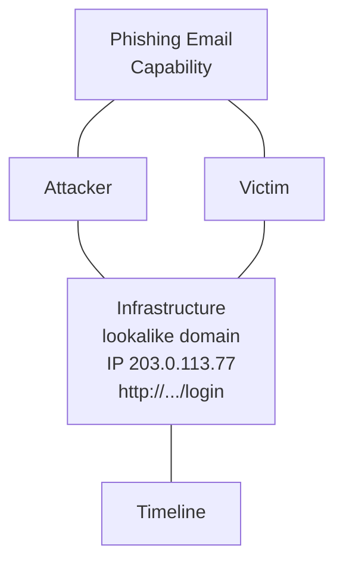
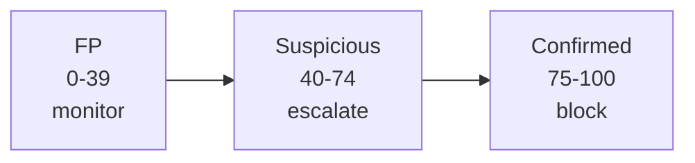

# Methodology

How the lab works: NIST workflow, Diamond Model, MITRE mapping, and scoring.

## NIST Workflow

| NIST Step | Lab Step | Artifact | Playbook |
|---|---|---|---|
| Detect | Intake: reporter, time, click? creds? | Intake notes | Step 1 |
| Analyze | Header + IOC extraction | `artifacts/headers/*.eml`, `phishlab/header.py`, `phishlab/extract.py` | Step 2-3 |
| Analyze | Reputation enrichment | `artifacts/reports/report.md` | Step 4 |
| Respond | Verdict → containment | Report + timeline | Step 5-6 |
| Recover | Detection gap + rule | `queries/sigma.yml` | Step 6 + docs/04 |

## Diamond Model

Example investigation (lookalike M365 harvest):
- **Adversary:** Unknown actor using `micorsoft-365security.com` (typosquat)
- **Capability:** Spearphishing Link → credential harvest kit
- **Infrastructure:** `micorsoft-365security.com`, `203.0.113.77`, `http://.../login`
- **Victim:** `victim@company.com`, host `WKSTN-07`

## MITRE ATT&CK

| Technique | When to use | Case | Signal |
|---|---|---|---|
| T1566.001 - Spearphishing Attachment | Attachment with macro / ISO / HTML / OneNote | Case 02 | `invoice-8841.pdf`, `.iso/.img/.xlsm/.one` flag |
| T1566.002 - Spearphishing Link | Link or QR-embedded URL | Case 02, 03 | URL + shortener, lookalike |
| T1078 - Valid Accounts | Creds entered on harvest page | Case 03 | Reporter confirmed login |
| T1137 - Office Application Startup | Follow-on: mailbox rule | Case 03 follow-on | Forwarding rules |
| T1114 - Email Collection | Follow-on: mailbox exfil | Case 03 follow-on | Forwarding rules (see `queries/splunk.spl`) |
| T1204.001 - User Execution | Click / scan QR | Case 02, 03 | Timeline: received → clicked |

Phrase in notes: `T1566.002 → T1078 (if creds). Hunt T1137/T1114 24h post-click.`

See `playbook.md:Step 6` for MITRE mapping.

## Scoring

Weights (from `src/phishlab/scoring.py:5`):
- VT ≥5 malicious → +90, else `ratio*70`
- AbuseIPDB → +score (or +score/2 if VT already high)
- OTX ≥3 pulses → +20
- Heuristics: lookalike +25, shortener +15, homograph +10, risky-ext +15, EICAR +80

Tuning in `src/phishlab/heuristics.py:5`. Deterministic tiers drive the runbook branches.

## Evidence Chain

Every investigation should have:
1. **Raw:** `.eml` + IOC file (`artifacts/headers/`, `artifacts/iocs/`)
2. **Processed:** `report.md` + `report.json` (machine-readable)
3. **Screenshots:** VT / URLScan / header analyzer in `artifacts/screenshots/` (if live)

## References

- NIST SP 800-61 Rev.2 - Incident Handling
- MITRE ATT&CK - T1566, T1078, T1137, T1114
- SANS Phishing Triage (header analysis order)
