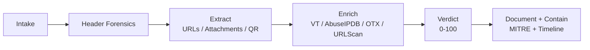

# Phishing Investigation Runbook

**NIST-aligned:** Detect → Analyze → Contain/Escalate.  
**Verdict:** FP `0-39` → Suspicious `40-74` → Confirmed `75-100`.

This runbook defines the steps the lab follows. `enrich.py` / `phishlab` automates Step 4; other steps are manual and documented in `artifacts/reports/`.



---

## Step 1 - Intake

Record: reporter, received time, subject, sender display vs envelope-from, ticket ID.

Do not click links or open attachments on host. Use sandbox (URLScan, VirusTotal) only.

Checklist:
- [ ] Header saved (`.eml` → `artifacts/headers/`)
- [ ] IOCs saved (`artifacts/iocs/case-0X.txt`)
- [ ] Did user click / scan QR / enter creds / enable macros?
- [ ] Timeline start: `received → reported`

---

## Step 2 - Header Forensics

Check in order:
1. `Return-Path` vs `From` vs `Reply-To` mismatch → spoof signal
2. `Authentication-Results`: `spf` / `dkim` / `dmarc` = `pass`|`fail`|`none`
3. `Received` chain: first external hop IP, date skew
4. Lookalike: `micorsoft-support.com` vs `microsoft.com`, display-name spoof
5. Bulk signals: `List-Unsubscribe` / `Precedence: bulk` → lowers suspicion

Tool:
```bash
PYTHONPATH=src python -m phishlab.header artifacts/headers/sample.eml
```

Signals:

| Signal | Low risk | High risk |
|---|---|---|
| Auth | SPF+DKIM+DMARC `pass` | Any `fail` |
| Headers | All domains match, no Reply-To mismatch | Reply-To ≠ From |
| Bulk | List-Unsubscribe + known sender | No bulk headers, first-seen sender |

---

## Step 3 - URL / Attachment / QR Extraction

Extract without detonating:
- **URLs:** Defang (`hxxp://`), expand shorteners via URLScan (do not `curl`)
- **Attachments:** Record filename, extension, `sha256`. Flag: `.iso/.img/.html/.htm/.xlsm/.one/.lnk/.zip`
- **QR codes:** Decode in sandbox, treat embedded URL as URL IOC

Tool:
```bash
PYTHONPATH=src python -c "from phishlab.extract import extract_iocs; print(extract_iocs('artifacts/iocs/case-02.txt'))"
```

Heuristics: `src/phishlab/heuristics.py` - lookalike, shortener, EICAR, homograph, risky-ext.

---

## Step 4 - Reputation Enrichment (auto)

Run:
```bash
python enrich.py -f artifacts/iocs/case-0X.txt -o artifacts/reports/report.md --mock
# live: remove --mock (needs .env keys)
# also: --json report.json --csv report.csv
```

| Source | IOCs | Signal | Threshold |
|---|---|---|---|
| VirusTotal v3 | hash / domain / IP / URL | malicious votes | ≥5 → +90 |
| AbuseIPDB | IP | confidence | ≥75 = high |
| OTX | domain / IP / hash / URL | pulse count | ≥3 → +20 |
| URLScan | URL | verdict | malicious=true |
| Heuristics | all | lookalike, shortener, EICAR | +25 / +15 / +80 |

If API is unavailable: use VT/URLScan/AbuseIPDB web UI and add screenshots to the case.

Code: `src/phishlab/enricher.py` - `vt_lookup`, `abuse_lookup`, `otx_lookup`, `urlscan_lookup`.

---

## Step 5 - Verdict Matrix

From `src/phishlab/scoring.py:5`:

| Score | Verdict | Action |
|---|---|---|
| `0-39` | FP - Likely-benign | Close, allowlist if needed |
| `40-74` | Suspicious | Escalate with `report.md` + header |
| `75-100` | Confirmed - Malicious | Block IOCs, reset/revoke, hunt 24h |

How to decide:

| Signal | FP | Suspicious | Confirmed |
|---|---|---|---|
| Auth | SPF/DKIM/DMARC pass, known sender | One fail + generic greeting | Fail + lookalike + Reply-To mismatch |
| URL/Hash | 0 VT hits, no shortener | 1-5 VT hits or shortener + newly seen | >5 VT hits or harvest kit |
| Behavior | No click, bulk headers | Click/scan but no creds | Creds entered / macro executed |

---

## Step 6 - Document + Contain

Each investigation should have:

1. Summary (what, verdict, risk)
2. Intake (received, reporter, clicked? creds?)
3. Header Analysis
4. IOC Table (value, type, source, VT/Abuse, disposition)
5. Enrichment Output (from `report.md`)
6. Timeline (UTC)
7. MITRE Mapping
8. Verdict + Next Steps

MITRE:
- `T1566.001` Spearphishing Attachment
- `T1566.002` Spearphishing Link (incl. QR)
- If creds harvested: `T1078` Valid Accounts, `T1137` / `T1114` follow-on (hunt via `queries/splunk.spl:4`)

Containment template (Splunk):
Block `[IOC defanged]` at SEG/firewall, quarantine message ID `[ID]` tenant-wide, force reset for `[user]`, revoke sessions, Splunk hunt `index=o365 Operation=New-InboxRule UserId=[user]` 24h pre/post click.

---

## Appendix - Hunt Queries (Splunk SPL)

See `queries/splunk.spl` + `queries/sigma.yml`.

**Lookalike / burst:**
```spl
index=email sourcetype=ms:o365:management
| eval sender_domain=mvindex(split(From,"@"),1)
| stats count values(Subject) as subjects values(recipient) as rcpts by sender_domain
| where count>10
| eval is_lookalike=if(match(sender_domain,"micorsoft|micosoft|paypa1|arnazon|g00gle|support-|-security"),1,0)
| where is_lookalike=1 OR count>50
| sort -count
```

**Campaign sweep:**
```spl
index=email
| where like(Subject,"INV-8841%") OR like(Subject,"Password expiry%")
| stats dc(recipient) as rcpts count by sender_domain Subject
| where count>5
```

**Mailbox rules follow-on (T1137):**
```spl
index=o365 sourcetype="o365:management" Workload=Exchange Operation IN ("New-InboxRule","Set-InboxRule")
| where UserId="victim@company.com" | table _time Operation Rules
```

---

## Appendix - Safe Handling

- Defang before sharing: `http://` → `hxxp://`, `.` → `[.]`, `@` → `[@]`.
- Sandbox only - never `curl` a phish URL.
- Use EICAR `44d88612fea8a8f36de82e1278abb02f` for tests.
- Lab IPs are TEST-NET `192.0.2.0/24`, `198.51.100.0/24`, `203.0.113.0/24` - safe.
